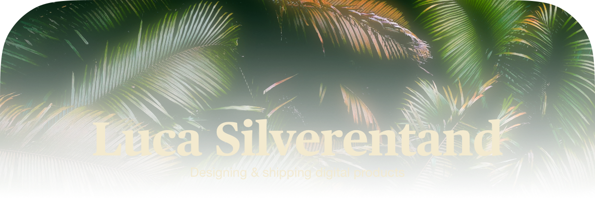

<picture>
<source media="(prefers-color-scheme: dark)" srcset="assets/banner-dark.webp" />
<source media="(prefers-color-scheme: light)" srcset="assets/banner-light.webp" />

</picture>

### About Me

- Owner of [@seventwo-studio](https://github.com/seventwo-studio) — building apps & websites
- Primary languages: **TypeScript**, **Rust**, **Swift**, **Shell**
- Interests: developer tooling, iOS apps, AI workflows, Kubernetes, home automation

  

  

        

### GitHub Stats

<picture>
<source media="(prefers-color-scheme: dark)" srcset="https://streak-stats.demolab.com?user=lucasilverentand&theme=tokyonight&hide_border=true&background=00000000" />
<source media="(prefers-color-scheme: light)" srcset="https://streak-stats.demolab.com?user=lucasilverentand&theme=default&hide_border=true&background=00000000" />

</picture>

### Projects

#### Personal

| Project | Description |
| --- | --- |
| [**lumo-optimized**](https://github.com/lucasilverentand/lumo-optimized) | A performance-focused Fabric modpack for Minecraft 1.21.8 with quality-of-life improvements, optimized rendering, and beautiful visuals. |
| [**kustodian**](https://github.com/lucasilverentand/kustodian) | A GitOps templating framework for Kubernetes with Flux CD - Define templates in YAML, extend with plugins |
| [**lucasilverentand.com**](https://github.com/lucasilverentand/lucasilverentand.com) | Personal website for Luca Silverentand |
| [**skills**](https://github.com/lucasilverentand/skills) | 72 Claude Code skills organized into 16 plugins and 7 intent-based bundles |
| [**artemis-lunar-wallpapers**](https://github.com/lucasilverentand/artemis-lunar-wallpapers) | Free high-resolution wallpapers from NASA's Artemis II mission. Desktop and phone sizes. |
| [**claudeline**](https://github.com/lucasilverentand/claudeline) | Customizable status line for Claude Code with themes, git, cost tracking, and usage monitoring |
| [**tkn**](https://github.com/lucasilverentand/tkn) | Shell proxy that optimizes CLI output for AI coding assistants by reducing token usage |
| [**clusage**](https://github.com/lucasilverentand/clusage) | macOS menu bar app to track Claude API usage across multiple accounts |
| [**canaveral**](https://github.com/lucasilverentand/canaveral) | Rust CLI for automated package and app release workflows |
| [**pane**](https://github.com/lucasilverentand/pane) | Rust TUI agent manager with daemon, protocol, and terminal interface |
| [**tarmac**](https://github.com/lucasilverentand/tarmac) | Native macOS app that runs ephemeral GitHub Actions runners inside virtual macOS VMs on Apple Silicon |
| [**unifi-cli**](https://github.com/lucasilverentand/unifi-cli) | CLI and MCP server for the UniFi Network API with 67 auto-generated commands |
| [**apple-music-mcp**](https://github.com/lucasilverentand/apple-music-mcp) | MCP server for controlling Apple Music from Claude Code and other AI assistants |
| [**ha-inhabit**](https://github.com/lucasilverentand/ha-inhabit) | Visual home editor and sensor automation |
| [**lumo-server**](https://github.com/lucasilverentand/lumo-server) | Docker image for running a modded Minecraft server with backup and management scripts |
| [**dot-steward**](https://github.com/lucasilverentand/dot-steward) | Rust CLI for declarative dotfile management with symlink tracking |
| [**labelwriter-4xl**](https://github.com/lucasilverentand/labelwriter-4xl) | CUPS print server with DYMO LabelWriter 4XL drivers for Kubernetes |
| [**privado-proxy**](https://github.com/lucasilverentand/privado-proxy) | Privado VPN SOCKS5 Proxy using WireGuard |
| [**home-automation**](https://github.com/lucasilverentand/home-automation) | Home Assistant blueprints and custom sensor configurations |
| [**nordvpn-proxy**](https://github.com/lucasilverentand/nordvpn-proxy) | Docker container running NordVPN with a SOCKS5 proxy via Dante |

#### [@seventwo-studio](https://github.com/seventwo-studio)

| Project | Description |
| --- | --- |
| [**runner**](https://github.com/seventwo-studio/runner) | Self-hosted GitHub Actions runner image with Playwright, Docker, Bun, and Maestro |
| [**pulse**](https://github.com/seventwo-studio/pulse) | Seven — AI-native version control system |
| [**handbook**](https://github.com/seventwo-studio/handbook) | SevenTwo Studio engineering principles and coding practices |
| [**devcontainers**](https://github.com/seventwo-studio/devcontainers) | Docker images for GitHub Actions runners and devcontainers with multi-arch support |
| [**homebrew-tap**](https://github.com/seventwo-studio/homebrew-tap) | Homebrew tap for seventwo-studio apps |
| [**create-seventwo**](https://github.com/seventwo-studio/create-seventwo) | Bun CLI scaffolder for production-ready Cloudflare Workers monorepo projects |

### Contributions

<picture>
<source media="(prefers-color-scheme: dark)" srcset="https://raw.githubusercontent.com/lucasilverentand/lucasilverentand/output/profile-night-view.svg" />
<source media="(prefers-color-scheme: light)" srcset="https://raw.githubusercontent.com/lucasilverentand/lucasilverentand/output/profile-green-animate.svg" />

</picture>

